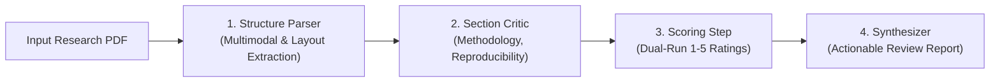

# Minions 🤖🔬

**Minions** is a multi-agent research assistant pipeline for automated, evidence-grounded scientific paper review. Instead of producing generic commentary, Minions parses academic PDFs into a structured multimodal map and critiques each section based on verifiable document evidence.

---

## 🏗️ Architecture & Vertical 1 Pipeline

Minions is built as a pipeline of specialized agents and steps:



### 1. Structure Parser (Phase 1)
- **Multimodal Document Processing**: High-resolution page rendering, figure cropping, and tabular Markdown extraction.
- **Multi-Column Reading Order Sorting**: Robust column gutter detection and full-width block handling to prevent interleaved text.
- **Equation Engine**: LaTeX reconstruction with confidence threshold ($\ge 0.80$) and automatic high-resolution visual fallback.
- **Grounding Index**: Deterministic anchor IDs (`sec_methodology_b01`, `fig_1`, `tab_1`, `eq_1`) with page coordinates and verbatim text.
- **Canonical Section Mapping**: Standardizes paper sections (`abstract`, `introduction`, `methodology`, `results`, `discussion`, `conclusion`, `references`).
- **Structured Schema (v1.0.0)**: Pydantic-validated JSON representation with per-section diagnostic confidences.

---

## 📦 Installation

```bash
# Clone the repository
git clone https://github.com/Prakku09/Minion-robo.git
cd Minion-robo

# Install dependencies (Python 3.10+)
pip install -e ".[dev]"
```

---

## 🚀 Quickstart & Usage

### Parse a Scientific PDF
```bash
# Run via CLI
minions-parse path/to/paper.pdf --out .minions/runs/my_paper

# Or run via Python module
python -m minions.cli path/to/paper.pdf --out .minions/runs/my_paper
```

### Output Artifacts
The parser outputs:
- `.minions/runs/<paper_id>/01_structure_parser.json`: Complete structured JSON map.
- `.minions/runs/<paper_id>/assets/pages/`: 150–200 DPI rendered page images.
- `.minions/runs/<paper_id>/assets/figures/`: High-resolution cropped figures and plots.
- `.minions/runs/<paper_id>/assets/tables/`: Cropped tables and Markdown grids.
- `.minions/runs/<paper_id>/assets/equations/`: Cropped visual equations for fallback cases.

---

## 🧪 Running the Test Suite

Run the full automated test suite (including multi-column sorting, grounding round-trip, and validation on real papers):

```bash
pytest -v
```

### Test Coverage
1. `tests/test_schema.py`: Schema v1.0.0 construction, validation, and strict extra field rejection.
2. `tests/test_reading_order.py`: Multi-column layout reading sequence validation across vertical gutters.
3. `tests/test_grounding_roundtrip.py`: Verifies anchor ID bounding boxes and text retrieval against raw PDF.
4. `tests/test_pipeline_real_papers.py`: Validated on:
   - **Attention Is All You Need** (Vaswani et al., 11 pages, NeurIPS)
   - **LoRA: Low-Rank Adaptation** (Hu et al., 14 pages, ICLR)
   - **Deep Residual Learning (ResNet)** (He et al., 12 pages, CVPR)
   - **Spatial Stochastic Dynamics** (Single-column mathematical biology)

---

## 📄 License

MIT License.
